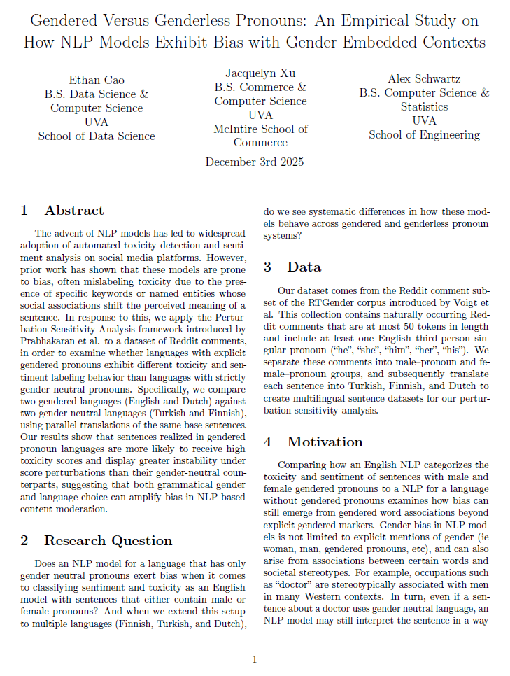

# Multilingual Gender Bias in NLP

This repository contains code and the paper **"Gendered Versus Genderless Pronouns: An Empirical Study on
How NLP Models Exhibit Bias with Gender Embedded Contexts"**, evaluating gender bias in multilingual NLP models, specifically in toxicity detection and sentiment analysis systems.

## Overview

This research project is a result of CS2501: Intro to Research by Prof. Morrison at UVA School of Engineering. The paper compares model behavior across languages with gendered third-person pronouns (English, Dutch) and languages with gender-neutral pronouns (Finnish, Turkish). By analyzing how toxicity and sentiment scores vary when the only difference is the gendered pronoun used, we can measure the extent of gender bias encoded in these models.

  

## Methods

- Uses pre-trained transformer models from HuggingFace for toxicity detection and sentiment analysis in English, Dutch, Finnish, and Turkish
- Evaluates sentences with matched semantic content but different gendered pronouns
- Computes score distributions and statistical comparisons across pronoun types
- Visualizes bias patterns through comparative charts

## Data

Experiments use the [RtGender dataset](https://nlp.stanford.edu/robvoigt/rtgender/) from Stanford NLP, which provides sentences annotated with gendered references.

## Requirements

- Python 3.x
- PyTorch
- Transformers
- HuggingFace
- pandas, matplotlib, numpy